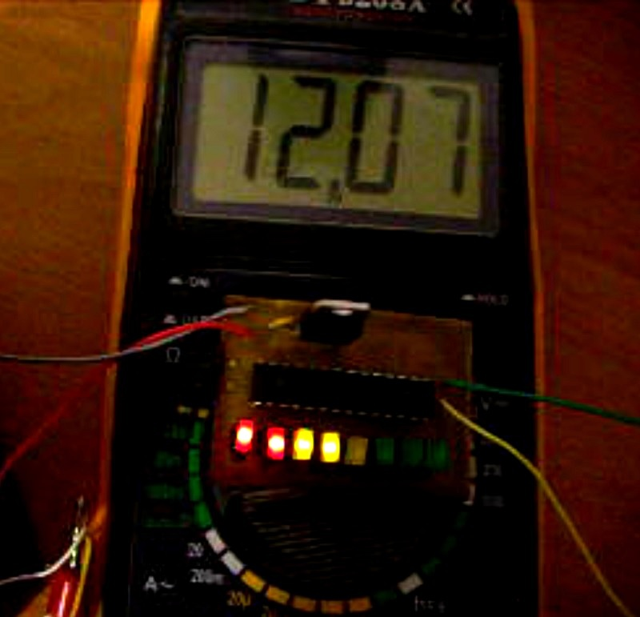

<h2>Индикатор разряда свинцового аккумулятора.</h2>

При конструировании устройств, имеющих автономное питание от аккумуляторов, почти всегда возникает проблема - как отключать нагрузку. При использовании li-ion источников питания – нагрузку выключает плата защиты, находящаяся внутри любой батареи.

Если же вы используете свинцовый аккумулятор – такой платы нет. И существует риск довести батарею до глубокого разряда. Длительный разряд ниже 10 вольт (12 вольтовой свинцовой батареи) приведет к разрушению пластин и потери емкости. Особенно это критично для дешевых «гелевых» аккумуляторов.

Данное устройство предназначено для отключения нагрузки при полном разряде батареи.

В схеме присутствует «buzzer» для подачи звукового сигнала. Линейка из 8 светодиодов показывает текущий уровень заряда.
Микроконтроллер управляет n-p-n транзистором подключенным к затвору полевого транзистора IRF9540.
В качестве стабилизатора питания использована LM7805.

В целях уменьшения размеров печатной платы индикация сделана 8-ми шаговая. При желании можно расширить количество уровней.

<strong>Логика работы</strong> 
Если напряжение выше порога - загорается соответствующий светодиод, если ниже - гаснет.

Как только напряжения на батареи достигнет «красной зоны» 10.5 в, начинает пищать «бузер» и мигать два оставшиеся светодиода.
Если напряжение опускается ниже 9.8 в, прекращается звуковой сигнал, и выдается один короткий импульс на выводы PB1, PB0.
 По умолчанию на PB1, PB0 присутствует логический уровень «1». При достижение порога сменяется на лог «0».
Далее если происходит рост напряжения, то только при достижение порога в 10.5в, возможна очередная смена сигналов на PB1, PB0.
Такой гистерезис был сделан для корректной работы схемы выключения/включения нагрузки. Так как при отключении нагрузки от батареи напряжение на ней постепенно увеличивается.

Шаги индикации напряжений: 
«Зеленая зона» 13.8в , 13.3в ,12.7в 
«Желтая зона»  12.2в , 11.7в , 11.1в 
«Красная зона» 10.5в , 9.8в 

Возможно небольшое отличие напряжений, связанное с погрешностью АЦП.
Цикл измерения повторяется каждые 0.5 с. Это сделано что бы исключить реакцию на импульсные помехи.
Шаги напряжений легко изменить на другие. Для этого необходимо в исходнике поменять значение уровней. Уровни заданы в 16-ти ричной системе. Например 13.8в - 3B0, 11.1в - 2F4 и т.д.

Константы рассчитываются по формуле <strong>adc = Vin * 1024 / Vref</strong> 
Где adc – значение, которое измерит АЦП микроконтроллера при напряжении на выводе равном Vin. Vref = 2.56В - внутренний источник опорного напряжения.  
На основании номиналов делителя R1, R2 рассчитывается требуемое значение костанты.

Схема устройства 

Данный индикатор подойдет для 6 вольтовой батареи, и сборки Ni-Cd, Ni-Mh аккумуляторов. Потребуется пересчитать «пороговые числа», подобрать другие номиналы R1, R2. Обеспечить микроконтроллер питанием в допустимых диапазонах.
При максимальном напряжении на входе делителя, на его выходе должно быть не более 2.56в. 

Потребляемый ток в режиме индикации ~40 мА, без индикации 10мА.

Разводка платы выполнена в Sprint Layout.
На фото со стороны дорожек вы можете увидеть p-n-p транзистор, который был заменен на n-p-n.
Fuse  программировать не нужно. Установлены  заводские. Используется микроконтроллер atmega8 в dip корпусе.

Прошивка написана на ассемблере в среде Atmel studio 6. 
Проект разработан в 2011 году.

